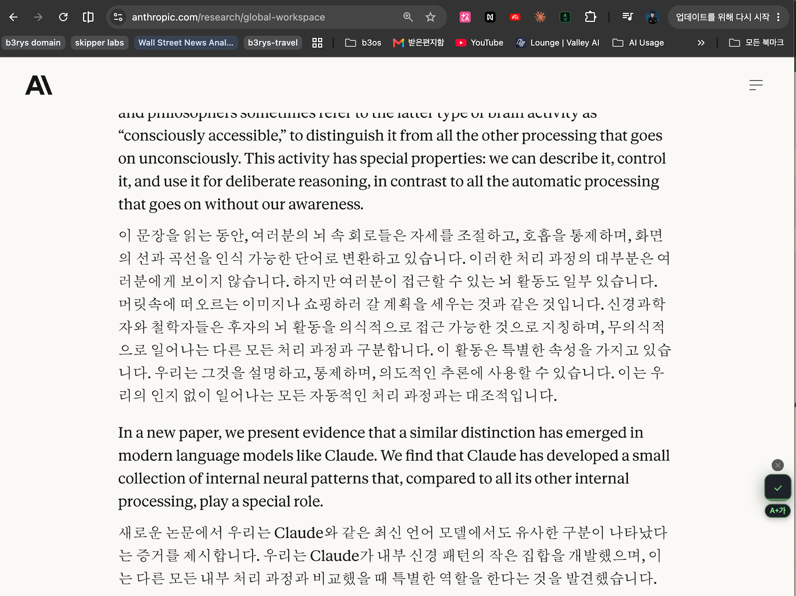
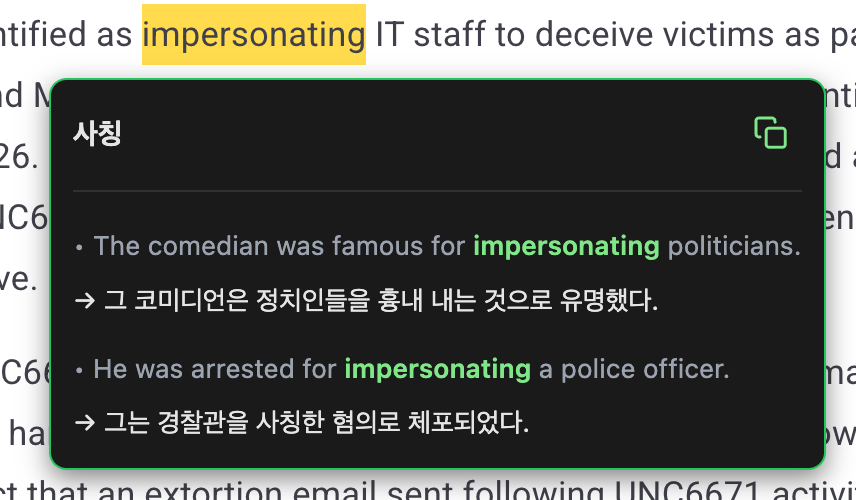
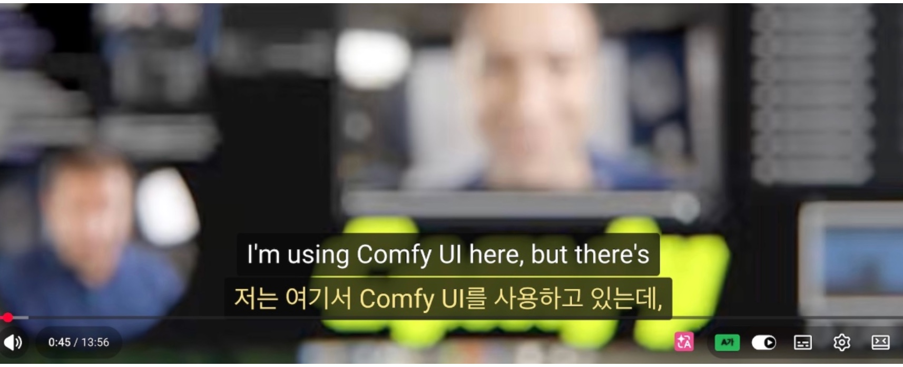
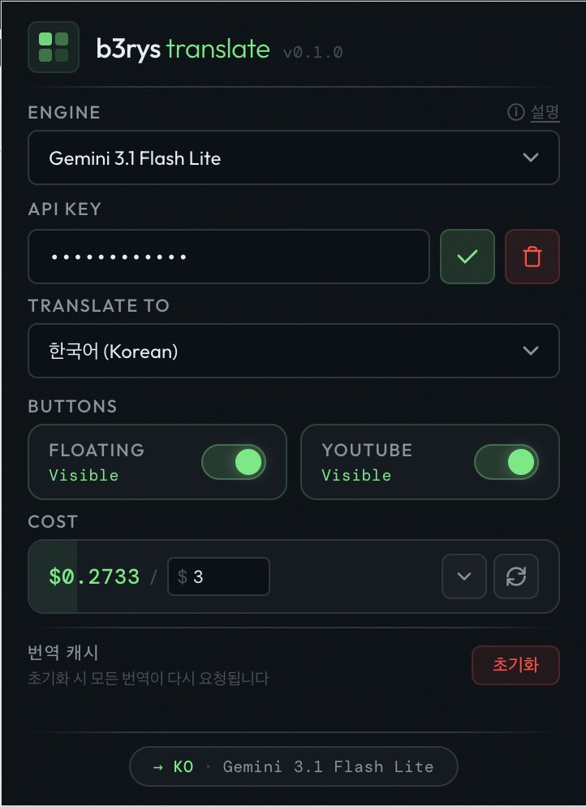

# b3rys translate

웹페이지 원문을 유지하면서 바로 아래에 번역을 표시하는 Chrome 확장 프로그램.
YouTube 이중자막(원문 + 번역)도 지원합니다.

> _A bilingual translation Chrome extension — keeps the original text and shows the translation right below it, paragraph by paragraph. Works on web pages and YouTube subtitles._

[](LICENSE)


📋 [TODO](TODO.md) · 🤝 [기여 가이드](CONTRIBUTING.md)

### 웹페이지 번역

원문 아래에 번역이 문단 단위로 삽입됩니다.



### 단어 선택 번역

단어를 드래그하면 번역 + 예문이 팝업으로 표시됩니다.



### YouTube 이중자막

원문 위에 번역이 함께 표시됩니다.



---

## 주요 기능

- **문단 단위 이중 번역** — 원문을 유지하고 바로 아래에 번역 삽입 (병행/대치 모드 전환)
- **10개 언어 지원** — 타겟 언어 선택, 소스 자동 감지, 언어별 캐시 분리
- **YouTube 이중자막** — 원문 + 번역 오버레이, rolling 번역, 표시 모드 순환
- **단어/문장 선택 번역** — 드래그 팝업, 단어 모드는 예문 2개 + 발음 듣기
- **다중 엔진** — Gemini / OpenAI / Anthropic 자유 전환, 엔진별 키 독립 저장
- **비용 추적** — 누적 비용·토큰 사용량 표시, 한도 설정, 플로팅 버튼 배터리 게이지
- **동적 콘텐츠 대응** — MutationObserver로 무한 스크롤·SPA 자동 번역
- **LRU 캐시** — 번역 결과 캐싱 (TTL 7일, 최대 1000개)

---

## 설치

두 가지 방법이 있습니다. **Claude Code**를 쓴다면 방법 A가 가장 빠릅니다.

### ⚡ 방법 A — Claude Code 스킬 (`/b3:translate`)

[Claude Code](https://claude.com/claude-code) 사용자는 대화만으로 **설치 → API 키 설정 → 사용법**까지 안내받을 수 있습니다.
이 저장소는 Claude Code 플러그인 마켓플레이스이기도 합니다. Claude Code에서 아래 두 명령으로 추가·설치하면 `/b3:translate`가 생깁니다.

```
/plugin marketplace add b3rys/b3rys-translate
/plugin install b3@b3rys
```

설치 후 실행:

```
/b3:translate
```

> 플러그인 설치가 번거로우면, 그냥 이 저장소 URL을 Claude Code 채팅에 붙여넣고 "b3rys 번역 확장 설치해줘"라고 해도 됩니다. 스킬이 동일하게 안내합니다.

스킬은 GitHub Release에서 빌드된 zip을 받아 Chrome 로드부터 엔진·API 키 설정, 첫 번역 시연까지 단계별로 안내합니다. (빌드된 zip을 쓰므로 Node.js가 없어도 됩니다.)

> 마켓플레이스: [.claude-plugin/marketplace.json](.claude-plugin/marketplace.json) · 플러그인: [.claude-plugin/plugin.json](.claude-plugin/plugin.json) · 스킬: [skills/translate](skills/translate/)

### 🔧 방법 B — 직접 설치 (수동)

소스에서 빌드해 개발자 모드로 로드합니다. (Chrome 웹스토어 등록 준비 중)

**1. 소스 받기**

```bash
git clone https://github.com/b3rys/b3rys-translate.git
cd b3rys-translate
```

**2. 빌드**

```bash
npm install
npm run build
```

`dist/chrome-mv3` 폴더에 확장 프로그램이 생성됩니다.

**3. Chrome에 로드**

1. Chrome에서 `chrome://extensions` 접속
2. 우측 상단 **개발자 모드** 활성화
3. **압축해제된 확장 프로그램을 로드합니다** 클릭
4. `dist/chrome-mv3` 폴더 선택

**4. API 키 설정**

Chrome 툴바에서 확장 프로그램 아이콘 클릭 → 팝업에서 엔진 선택 및 API 키 입력.
(Engine 라벨 옆 **ⓘ 설명**에 마우스를 올리면 엔진별 가격·특징 비교 표가 뜹니다.)



| 엔진                      | 발급 위치                                                        | 가격 (1M 토큰, in/out) | 비고               |
| ------------------------- | ---------------------------------------------------------------- | ---------------------- | ------------------ |
| **Gemini 3.1 Flash Lite** | [Google AI Studio](https://aistudio.google.com/apikey)           | $0.25 / $1.50          | 무료 할당량 · 권장 |
| **GPT-4.1 Nano**          | [OpenAI Platform](https://platform.openai.com/api-keys)          | $0.10 / $0.40          | 최저가 · 비추론    |
| **Claude Haiku 4.5**      | [Anthropic Console](https://console.anthropic.com/settings/keys) | $1.00 / $5.00          | 품질 우선          |

엔진별로 API 키가 독립 저장되므로, 여러 엔진의 키를 미리 설정해 두고 자유롭게 전환할 수 있습니다.
API 키는 브라우저의 `chrome.storage`에만 저장되며 외부로 전송되지 않습니다 (번역 요청은 사용자가 선택한 엔진 API로 직접 전송).

---

## 사용법

설치 방법과 무관하게 기능은 동일합니다.

### 웹페이지 번역

- 페이지 우측 하단의 **플로팅 버튼** (A→가) 클릭 → 번역 시작
- 번역 ON 상태에서 다른 페이지로 이동하면 자동으로 번역이 계속됩니다
- 버튼을 다시 클릭하면 번역 제거 (OFF)

### 선택 번역

- 텍스트를 드래그하면 선택 영역 끝에 번역 트리거 버튼이 표시됩니다
- **단어 선택**: 번역 + 예문 2개 + 발음 듣기가 컴팩트 팝업으로 표시
- **문장 선택**: 번역이 팝업으로 표시 + 복사 버튼
- 플로팅 버튼 OFF 시 선택 번역도 함께 비활성화

### YouTube 자막 번역

- YouTube 영상 플레이어 하단 컨트롤 바에 **A가** 번역 버튼이 추가됩니다
- 클릭하면 자막을 가져와서 이중자막으로 표시 (표시 모드 순환: 원문+번역 → 원문 → 번역 → 끄기)
- 다시 클릭하면 해제
- 원문 자막이 타겟 언어와 같으면 번역 없이 원문만 표시합니다

### 비용 추적

- 팝업 하단 **COST**에서 누적 비용 확인
- 상세보기(▼) 클릭 시 엔진별 토큰 사용량 + 비용 표시
- **Limit** 설정으로 비용 한도 지정 (초과 시 번역 자동 차단, 비워두면 무제한)
- 플로팅 버튼에 배터리 게이지로 한도 대비 사용량 시각화 (초록→노랑→빨강)
- 초기화(↻) 버튼으로 사용량 리셋

---

## 개발

```bash
npm run dev          # 개발 모드 (HMR, Chrome 자동 로드)
npm run build        # 프로덕션 빌드
npm run test         # 테스트 실행 (252 tests)
npm run typecheck    # 타입 체크
npm run lint         # ESLint 검사
npm run format       # Prettier 포맷 적용
npm run zip          # 배포용 zip 생성
```

코드 수정 후 Chrome에서 확인하려면:

1. `npm run build` 실행
2. `chrome://extensions`에서 확장 프로그램 리로드 (↻)
3. 대상 페이지 새로고침

### 기술 스택

- **Framework**: [WXT](https://wxt.dev/) (Web Extension Framework) + Manifest V3
- **Language**: TypeScript (vanilla, no framework)
- **Test**: Vitest + happy-dom (252 tests)

### 기술 문서

코드 수정 전에 해당 영역의 문서를 먼저 읽으면 전체 구조를 빠르게 파악할 수 있습니다.

| 문서                                 | 내용                                                                               |
| ------------------------------------ | ---------------------------------------------------------------------------------- |
| [docs/pipeline.md](docs/pipeline.md) | 번역 파이프라인 (텍스트 감지 3단계, 필터 체인, 주입 4경로, 사이트 룰, 배치 처리)   |
| [docs/ui-guide.md](docs/ui-guide.md) | UI 동작 가이드 (FAB 상태, 모드 전환, 주입 경로별 before/after, YouTube 오버레이)   |
| [docs/safety.md](docs/safety.md)     | 안전 장치 & 상태 머신 (circuit breaker, rate limiter, 경쟁 조건 보호, Observer 룰) |
| [TODO.md](TODO.md)                   | 작업 트래커                                                                        |

## 기여

버그 리포트, 기능 제안, PR 모두 환영합니다. [기여 가이드](CONTRIBUTING.md)를 참고해 주세요.

## 라이선스

[Apache License 2.0](LICENSE) © 2026 b3rys

재배포하거나 2차 저작물을 만들 때는 [NOTICE](NOTICE)와 [LICENSE](LICENSE)를 함께 포함하고,
원저작자(**b3rys** / 이 저장소)를 표기해 주세요. (Apache License §4)
